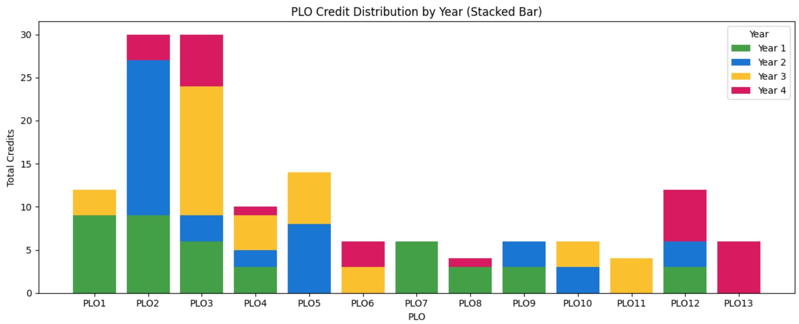

# 📘 PLO-Driven Curriculum Design Platform
### Outcome-Based Engineering Curriculum Mapping with Django

[](https://creativecommons.org/licenses/by-nc/4.0/)
[]()

---

## ✅ Try Online First — Railway Demo

To explore the full functionality without installation:

🔗 **Live Web App:**  
👉 https://plo-driven-curriculum-design.up.railway.app/

> No login required — freely browse credit tables, PLO mapping, course lists, and PLO distribution charts.

---

## ✅ Overview

This Django-based platform supports **Outcome-Based Education (OBE)** and curriculum mapping aligned with  
the **Washington Accord Graduate Attributes (GA1–GA12)**.

Key capabilities include:

- Credit distribution planning across 8 semesters
- Real-time PLO analytics and credit validation
- Dynamic Course List editing and PLO tagging
- Structured CLO–PLO mapping foundation
- Multi-database handling (Example vs. Real)
- Fully offline or cloud-ready deployment

Case study included:  
> Bachelor of Engineering in Electrical Engineering Program (2023)  
> Rajamangala University of Technology Krungthep, Thailand

---

## 🏛 Core System Architecture

| Module | Responsibility |
|--------|----------------|
| Credit Matrix | Manage semester-wise curriculum structure |
| Course List Manager | Edit courses per category and semester |
| PLO Analytics | Visualize PLO credit summary & distribution |
| Multi-DB Mode | Separation between demo & editable mode |
| Deployment Tools | Static files + production server support |

---

## 🧪 Case Study Summary

- 146 Total Credits
- 12 Official PLOs (GA-aligned)
- **PLO13** — reserved for open-elective competency mapping

---

## 🖥 Screenshots & UI Overview

### **Credit Matrix Dashboard**


### **Course List Editor**


### **PLO Distribution Chart**


---

## 🚀 Local Installation (Optional for Reviewers)

> Recommended: Use the **online demo** above first ✅  
> Local setup is available for advanced evaluation.

**1️⃣ Clone this repository**

```bash
git clone https://github.com/w-chainarong/PLO-Driven-Curriculum-Design.git
cd PLO-Driven-Curriculum-Design
