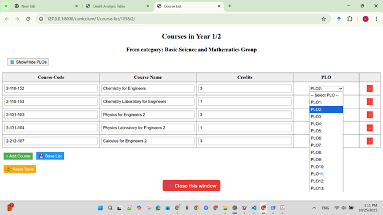

# 📘 PLO-Driven Curriculum Design Platform  
**Outcome-Based Engineering Curriculum Mapping with Django**

[](https://creativecommons.org/licenses/by-nc/4.0/)
[]()

---

## ✅ Overview

This open-source Django-based platform supports **Outcome-Based Education (OBE)** and curriculum mapping aligned with **Washington Accord Graduate Attributes (GA1–GA12)**.

Key Capabilities:
- Dynamic curriculum credit planning
- Course Learning Outcome (CLO) creation and alignment
- Program Learning Outcome (PLO) mapping and traceability
- Automated PLO credit analytics and visualization dashboards

This repository includes a demonstration based on:

> **Bachelor of Engineering in Electrical Engineering Program (2023)**  
> Rajamangala University of Technology Krungthep (RMUTK), Thailand

✅ Fully offline operation  
✅ No external APIs required  
✅ Reviewer-friendly sample data included

---

## 🌐 Live Demo (Hosted on Railway)

Try the platform online — no installation required ✅  
➡️ https://plo-driven-curriculum-design.up.railway.app/

> *Demo mode — changes will not be permanently saved.*

---

## 🏛 System Architecture

| Module | Functionality |
|--------|---------------|
| Credit Matrix | Semester-wise credit distribution |
| CLO–PLO Mapping | Outcome alignment with traceability |
| Course List Editor | Modify course structure and PLO assignments |
| Multi-Database Support | Example / Real modes for testing vs. production |
| Analytics Dashboard | PLO credit distribution visualization |

---

## 🧪 Case Study Context

- 146 total credits across eight semesters  
- 12 PLOs aligned with Washington Accord  
- **PLO13** reserved for elective-based outcome assignment  

---

## 🖥 User Interface Overview

### ✅ Figure 1 — Credit Matrix Dashboard


---

### ✅ Figure 2 — Course List Editor


---

### ✅ Figure 3 — PLO Credit Distribution Chart


---

## ✅ Features

| Category | Capability |
|---------|------------|
| Curriculum Design | Add/remove/reorder credit components dynamically |
| Outcome Alignment | Structured CLO–PLO mapping |
| Analytics | Graph-based PLO outcome validation |
| Deployment | Local execution or cloud hosting |
| License | Academic / non-commercial usage only |

---

## 🚀 Quick Start (Local Installation)

### ✅ Requirements
- Python **3.10+**
- pip installed
- SQLite3 (default on most systems)

---

### ✅ Installation

```bash
git clone https://github.com/w-chainarong/PLO-Driven-Curriculum-Design.git
cd PLO-Driven-Curriculum-Design
pip install -r requirements.txt
python manage.py runserver
